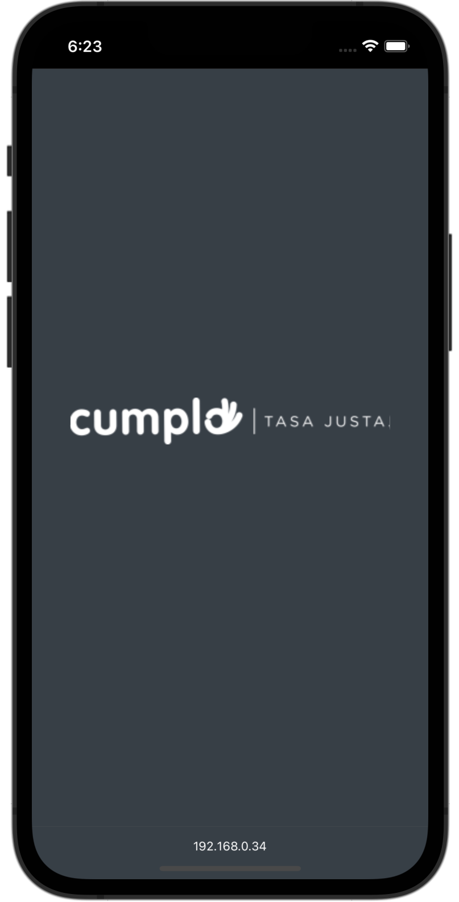

# Cumplo Challenge

  

## Overview

---

The challenge consists in creating the client interface for a web application
that lets the personal vote for the "employee of the month", with the objective
of demonstrating technical knowledge of different technologies, such as:

- HTML5
- CSS3
- Javascript
- & the use of a front end library, in my case, **React JS**.

Starting the challenge, we get a folder with some files:

- The requirements for the app in a `README` file.
- A backend folder containing node server code with an API for modifying/consuming data.
- And the UI/UX design with a prototype showing the project expected behaviour and the look and feel.

## Requirements

---

### User

- The user must be able to see the candidates.
- The user must be able to vote for a candidate.
- The user must be able to see who is the winner.

### General

- Authentication is not necessary.
- There must be a timer or countdown, it will let people vote for a candidate, when the countdown ends, nobody should be able to vote.

## How it works

---

When accessing the web app, we can see a "loading screen" with Cumplo's Logo.
Then the main screen, this screen will display all the employees with a button
to vote for the employee, this information comes from the backend API.

The countdown timer is on the top right of the application, personal can vote for
the employee they like if the timer hasn't ended yet.

When a user votes, they will see a screen saying "thanks for voting" and after a
few seconds they will be redirected to a "wait for results" screen.

If the user refreshes the app or tries to go to the main screen after they voted,
they are redirected to the "wait for results" screen (if the countdown timer hasn't ended yet).

When the timer finishes it redirects the users to the "winner" screen showing the person who won.

- React `Router` was used to manage the routing of the application.
- React Hook `useState` was used to manage component local state.
- React Hook `useContext` was used to create & consume contexts to keep track of state changes
  in children components.
- React Hook `useEffect` was used to create different effects when loading a certain
  screen or components (mostly API calls).

To accomplish all of this, we consume the API to show the generated
information of employees, we also used it to send information when the user
votes for a person.

When voting, we send the id of the person and the API will increment the user score.
When the timer finishes, the API will expose the person with the most amount of votes
and we will consume the API to show on the client who is the person who won.

## Preview

  

---

_Source code _
