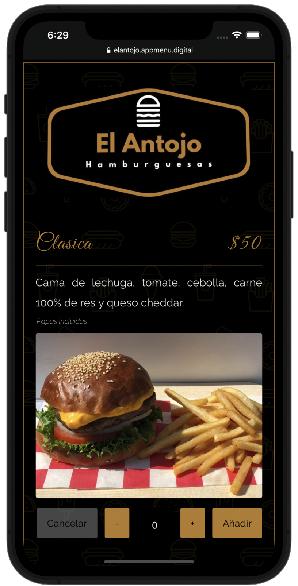
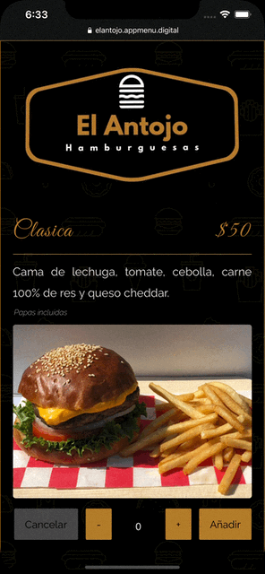

# El Antojo Hamburguesas

## Overview
---
This project is a web application that displays a digital menu where the clients can see the actual products,  prices & place an order from the selected products.
Having a digital menu, the business benefits from online presence & helps preventing covid spread by not having physical menu cards. Instead, we generate a QR Code in which can be used in tables, posters, signs or merchandise. This QR Code can be scanned with almost every smartphone and it sends you straight to the digital menu.

## How it works
---
Inside the digital menu, clients can see, select dishes they like & later on, see their order list. The client can place the order directly after filling a form with their contact information & delivery options. The order then will be sent to the Admins Whatsapp.

### Administrator
- The admin can modify the information about the dishes (availability, name, description, comments, price) using a Google Spreadsheets. This information will be reflected in the web app instantaneously after the admin saves the Spreadsheets changes.
- The admin can add, modify, delete information or "hide" dishes that are unavailable for the moment.

### Client
- The client can access the web aplication through the site URL or by scanning the QR Code.
- Inside the web app, he can see in real time the dishes price.
- The client can select dishes, modify if he wants to add other dishes, change the quantity or modify his order from the web app.
- When done with the order list, the client fills a small form with his name & food notes for his order & delivery options (pick up or delivery).
- The order list will be sent directly to the administrator Whatsapp.

## Preview 

  
  

This project was created with **React** & **Google Spreadsheets**.

Demo: [El Antojo Hamburguesas](https://dev-el-antojo.netlify.app)

*Source code not available.*

