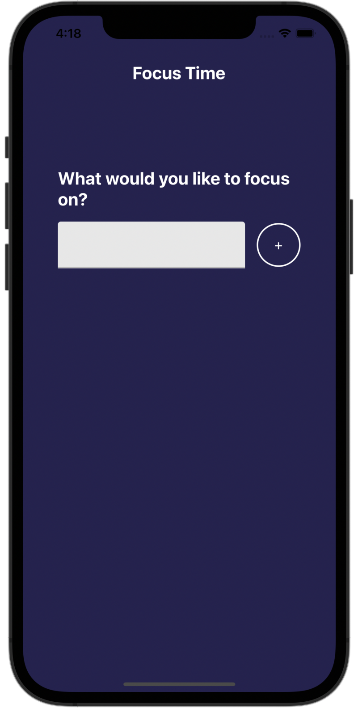
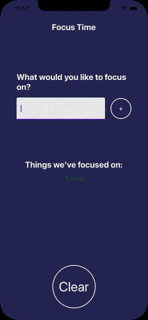

# FocusTime

## Overview
---
This project was created altogether with the udemy course: [**Complete React Native in 2021: Zero To Mastery**](https://www.udemy.com/course/complete-react-native-mobile-development-zero-to-mastery-with-hooks/) taught by **Andrei Neagoie** - *Senior Software Developer* & **Mo Binni** - *Software / Solutions Architect*.

This project has the goal of teaching different React Native functionalities such as:

- Components
- Importing & exporting components
- Hooks (useState & useEffect)
- Conditional Rendering
- Data persistance (AsyncStorage)
- Scalable project structure

A simple app where the user enters a task which wants to focus on, and choose between different times to start the timer. When the timer finish, the app will make the phone vibrate to indicate the time has finished.

## How it works
---
When entering the app, the user finds a simple screen: the app title and an input field for filling a task in which wants to focus on for an amount of time. When filling this field, the user presses the button (+) to start the countdown.

This will take us to the next screen, in which shows us different components:
- Counter
- Task title
- Progress Bar
- Control buttons

In this screen, we can see the progress of the task, we can also pause, resume or change the time we want for the task. It is possible to prematurely cancel the task with the X button.

When the countdown finishes, the phone will vibrate for a few seconds indicating the task has been finished. And will show in the home screen a listing of past tasks; green tasks indicates the task was done properly & the red ones were cancelled prematurely.

When exiting the app, the task list will still be stored & the user has the option of clearing the list with the "Clear" button.

## Preview

  

---
*[Source code available](https://github.com/josemoralesdev/focustime.git)*