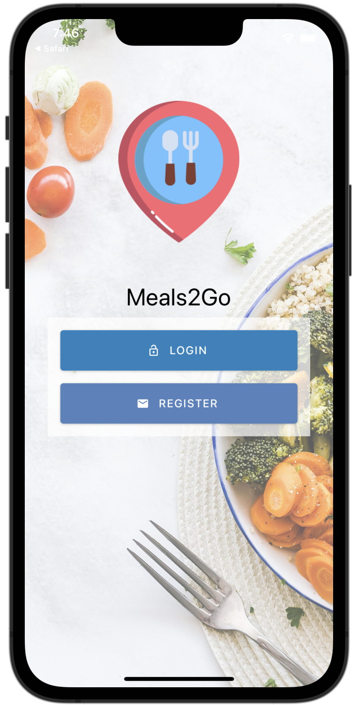

# MealsToGo

## Overview

---

This project was created altogether with the udemy course: [**Complete React Native in 2021: Zero To Mastery**](https://www.udemy.com/course/complete-react-native-mobile-development-zero-to-mastery-with-hooks/) taught by **Andrei Neagoie** - _Senior Software Developer_ & **Mo Binni** - _Software / Solutions Architect_.
This project has the goal of teaching advanced functionalities of React Native such as:

- Hooks (useRef, useContext, useState).
- React Native Hooks (useFocusEffect).
- Styled Components.
- Theming.
- Custom Fonts.
- Navigation.
- Expo Maps Integration.
- Google Maps & Geolocation API.
- AsyncStorage.
- Animations.
- Firebase Authentication & Cloud Functions.
- Error & loading Handling.
- Expo Camera Module.
- Stripe payments API.

It is a medium-advanced application that requires more than beginner knowledge in React Native.

## How it works

---

The main screen shows us two options, login in, or signing in, if we don't have an account, we can easily create one pressing on the register button & filling the register form. When we are done it will redirect us to the app.
If we already have an account, we just fill the login form & it will redirect us to the app if the login information is correct.

Inside the home tab, we can see information about a variety of nearby restaurants. We can change the location in the top input field to search other places.
In the restaurants cards listing we can press on them to view detailed information & we can add the restaurant to our favorite restaurants list if we want to.

In the **Map** tab, we can see a map of our location, it'll show nearby restaurants. We can press on a map location pin to see more information about each restaurant.

The app also has a **Settings** tab, where we can add a profile picture from our frontal camera, view our favorite restaurants & signing out of the app.

---

This project was created with **React Native**.

_Source code not available at the moment._
