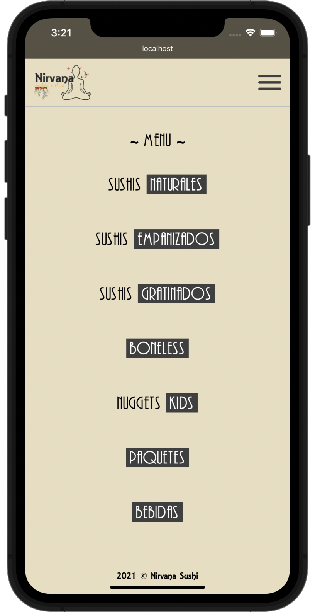

# Nirvana Sushi

## Overview

---

This project is a web application that displays a digital menu. Clients can see the actual products & prices (this projects doesn't have an ordering system for now).

Having a digital menu, the business benefits from online presence & helps prevent COVID spread by not having physical menu cards. Instead, we generate a QR Code in which can be used in tables, posters, signs or merchandise. This QR Code can be scanned with almost every smartphone, and it sends you straight to the digital menu.

This project leverages the framework **Gatsby**, it is an open-source framework that combines functionality from React, GraphQL & Webpack into a single tool for building extremely fast static websites & apps.

## How it works

---

After scanning the QR code from the restaurant, merchandise or accessing the site using a link, the clients can have access to the menu.

### Client

- The client can access the web application through the site URL or by scanning the QR Code.
- Inside the web app, clients can see real time prices.

This project was created with **React** & **Gatsby**.

Demo: [Nirvana Sushi's](https://nirvana-sushi.netlify.app)

_Source code not available._

_Supports devices from phones to tablets, not for desktop use at the moment._
