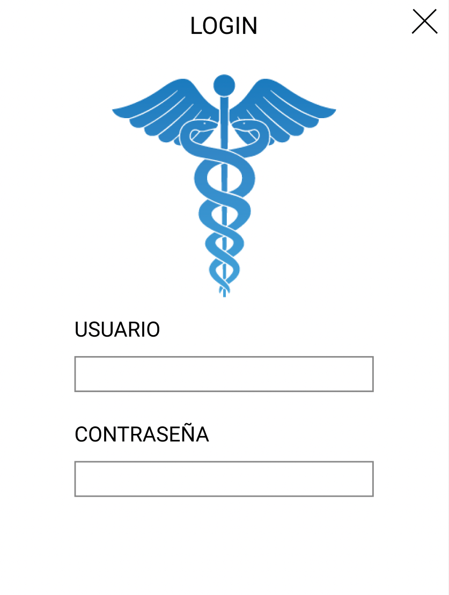

# Sistema Historial Clínico

## Overview
---
Desktop application created for a doctor's office.

One of the problems was, it didn't existed an efficient way for storing medical histories from the patients; before, medical histories were stored in a written way, but this mean, after every medical check, the doctor had to print, fill y later on store medical histories forms. It is a tedious process & it wasnt possible if the doctor had multiple patients waiting.

The proposed solution was to create a desktop app in which the doctor could easily use & save his patients information in a digital way, all of this inside a database in his computer. This made the process of saving the information faster & having this information in his reach, even better.

## How it works
---
The user executes the application shortcut from the desktop to access the application, then it will show a window for login in with his credentials and therefore, access the system.

Inside the system, the user can save new patients & later on create their respectives medical histories.

In the **Patients** module, it displays a listing with all of the patients information, and an input field on the top for filtering patients.
When double clicking on the desired patient listing or choosing a listing and clicking on the button "Show", the user can visualize the patient's information.
In this module, the user can view, modify, create or delete new patients.

In the Clinical history module, it shows a list of all the medical histories with an input field on the top for filtering the medical histories.

When double clicking a desired listing, it will display all the information on a bigger window, so the user can clearly see all of the information.
In this module, the user can view, modify, create or delete medical histories from **existing patients in the database**

---
This project was created using **C#** & **SQL Server Express**.

*Source code not available*.